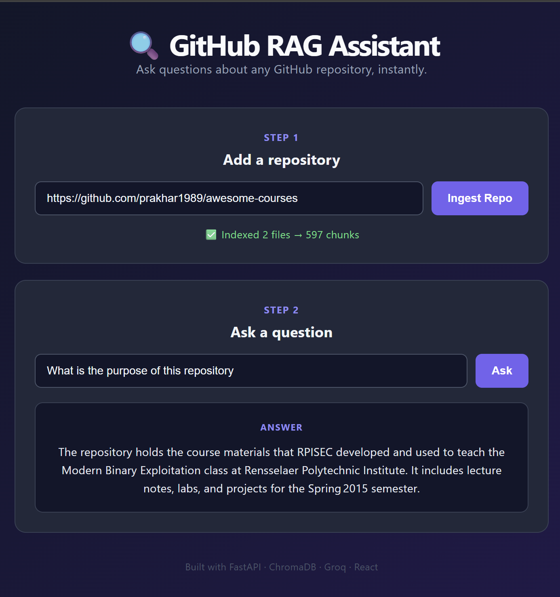

# 🔍 GitHub RAG Assistant

<p align="center">
  <em>Ask natural language questions about any public GitHub repository — powered by Retrieval Augmented Generation.</em>
</p>

<p align="center">
  
  
  
  
  
</p>

---

## 📖 Overview

**GitHub RAG Assistant** lets developers understand unfamiliar codebases faster. Instead of manually digging through files, you paste a GitHub repo URL, and the system indexes the entire codebase using semantic embeddings. You can then ask questions in plain English — like *"How does authentication work?"* — and get accurate, source-grounded answers instead of generic LLM guesses.

This solves a real problem: **LLMs don't know about your specific codebase**, and manually searching through hundreds of files is slow. RAG bridges that gap by retrieving only the relevant code before generating an answer — reducing hallucination and keeping responses grounded in the actual repository.

## 🎬 Demo



*Example: Indexing a repository and asking a question about its purpose — answer generated purely from retrieved context, with no external knowledge.*

## ✨ Features

- 🔗 Index any public GitHub repository by URL
- 💬 Ask natural language questions about the codebase
- 🧠 Semantic (meaning-based) search — not just keyword matching
- 🎯 Context-grounded answers — the LLM is instructed to say "I don't know" rather than hallucinate
- ⚡ Fast vector retrieval via ChromaDB
- 🎨 Clean, responsive chat-style UI

## 🏗️ Architecture
┌─────────────┐ ┌──────────────┐ ┌───────────────┐
│ GitHub URL │ ──▶ │ Clone + Read │ ──▶ │ Chunk Text │
└─────────────┘ └──────────────┘ └───────────────┘
│
▼
┌─────────────┐ ┌──────────────┐ ┌───────────────┐
│ ChromaDB │ ◀── │ Embeddings │ ◀── │ Text Chunks │
│ (Vector DB) │ │ (MiniLM-L6) │ └───────────────┘
└─────────────┘ └──────────────┘
          ── User asks a question ──
┌─────────────┐ ┌──────────────┐ ┌───────────────┐
│ User Query │ ──▶ │ Retrieve top │ ──▶ │ LLM (Groq) │
│ │ │ matching │ │ generates │
│ │ │ chunks │ │ grounded │
│ │ │ │ │ answer │
└─────────────┘ └──────────────┘ └───────────────┘

## 🛠️ Tech Stack

| Layer | Technology | Why |
|---|---|---|
| Backend API | FastAPI | Async, fast, auto-generated docs |
| Repo Cloning | GitPython | Programmatic Git operations |
| Embeddings | sentence-transformers (all-MiniLM-L6-v2) | Free, local, fast |
| Vector Store | ChromaDB | Lightweight, easy local setup |
| LLM | Groq (Llama 3.x) | Free tier, extremely fast inference |
| Frontend | React + Vite | Fast dev experience, component-based UI |

## ⚙️ Getting Started

### Prerequisites
- Python 3.10+
- Node.js 18+
- A free Groq API key (console.groq.com)

### 1. Clone this repository
```bash
git clone https://github.com/sakshikumari01/github-rag-assistant.git
cd github-rag-assistant
```

### 2. Backend setup
```bash
cd backend
python -m venv venv
venv\Scripts\activate

pip install -r requirements.txt
```

Create a `.env` file inside `backend/`:

Start the server:
```bash
uvicorn main:app --reload
```
Backend runs at `http://127.0.0.1:8000` — interactive docs at `/docs`.

### 3. Frontend setup
```bash
cd frontend
npm install
npm run dev
```
Frontend runs at `http://localhost:5173`.

## 🧠 How It Works

1. **Ingestion** — The target repo is cloned, and code/text files are read (binaries, node_modules, .git are skipped).
2. **Chunking** — File contents are split into overlapping ~500-character chunks so context isn't lost at boundaries.
3. **Embedding** — Each chunk is converted into a 384-dimension vector using a sentence-transformer model.
4. **Storage** — Vectors are stored in ChromaDB, a local vector database optimized for similarity search.
5. **Retrieval** — When a question is asked, it's embedded the same way, and the most semantically similar chunks are retrieved via cosine similarity.
6. **Generation** — Retrieved chunks + the question are passed to an LLM (Groq/Llama) with an instruction to answer only from the given context — reducing hallucination.

## 📌 Roadmap / Future Improvements

- [ ] Support indexing multiple repositories simultaneously
- [ ] Show source file citations alongside answers
- [ ] Persist chat history per session
- [ ] AST-based (structure-aware) chunking instead of fixed character splits
- [ ] Deploy backend (Render) + frontend (Vercel) for a live demo
- [ ] Add retrieval evaluation metrics (RAGAS)

## 🔗 Live Links

- **Live Demo:** [github-rag-assistant-three.vercel.app](https://github-rag-assistant-three.vercel.app)
- **Backend API:** [github-rag-assistant.onrender.com/docs](https://github-rag-assistant.onrender.com/docs)

> ⚠️ Note: Hosted on free-tier services — first request may take 30-50s (cold start), and works best with small-to-medium repos. See Known Limitations below.

## ⚠️ Known Limitations

- **Free-tier hosting timeout:** The live demo is deployed on Render's free tier, which has a ~30 second request timeout. This limits the `/ingest` endpoint to small-to-medium repositories in this demo — larger repos (500+ chunks) may time out. In a production environment, this would be solved with a background job queue (e.g., Celery or a cloud task queue), where ingestion runs asynchronously and the user receives immediate confirmation while indexing continues in the background.
- **Cold starts:** Free-tier instances spin down after inactivity, so the first request after idle time may take 30-50 seconds to respond while the server wakes up.
- Tested and confirmed working with small repositories such as [kennethreitz/samplemod](https://github.com/kennethreitz/samplemod).


## 📄 License

This project is open source and available for learning purposes.

---

<p align="center">Built as learning project to understand Retrieval Augmented Generation end-to-end.</p>

## 👩‍💻 Author

**Prem_Kumar_Gupta**

**Sakshi_Kumari**

[GitHub](https://github.com/sakshikumari01)
